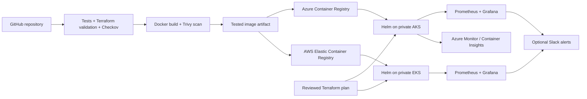

# Multi-Cloud CI/CD with AKS and EKS

A Node.js API, Terraform infrastructure for Azure and AWS, Helm deployments, GitHub Actions, and Prometheus/Grafana monitoring.

[](https://github.com/VinayReddi7206/multi-cloud-cicd-pipeline-with-kubernetes-terraform-observability/actions/workflows/ci.yaml)

**Current status:** The app runs in local Kubernetes with Helm, Prometheus/Grafana, and persistent monitoring storage. Automatic rollback, pod replacement, outage alert firing, and recovery have been verified locally and are included in CI. AKS/EKS deployment remains pending; the local demo requires no cloud provisioning. See the [validation record](docs/validation.md) for completed checks and hosted run evidence, or follow the [recruiter demo walkthrough](docs/demo.md).

This is a learning and portfolio project with production-oriented controls. Cloud deployment requires account-specific bootstrap and validation. No cloud resources are created just by cloning this repository or running CI.

The live multi-cloud deliverable is still pending. See the [completion criteria](docs/completion.md) for the remaining acceptance checks. Cloud workflows are disabled until funding and cloud bootstrap are ready; GitHub environment setup and a configuration readiness report are automated in the [setup guide](docs/setup.md).

## Public showcase and demo links

**[Open the public recruiter showcase](https://vinayreddi7206.github.io/multi-cloud-cicd-pipeline-with-kubernetes-terraform-observability/)** — explore the pipeline stages, recorded monitoring results, architecture, and verification evidence without installing anything.

The showcase is a hosted static website. The Node.js API and Grafana still run on the demo machine; the showcase does not connect to those services or present recorded metrics as live telemetry. Live AKS/EKS deployment remains pending under the project's zero-cloud-spend constraint. See [showcase hosting](docs/showcase.md) for its scope and source.

| Link | What you can see |
| --- | --- |
| [Public recruiter showcase](https://vinayreddi7206.github.io/multi-cloud-cicd-pipeline-with-kubernetes-terraform-observability/) | Hosted walkthrough, architecture, recorded health results and links to verifiable evidence; also linked from the repository's About section |
| [Verified local demo release](https://github.com/VinayReddi7206/multi-cloud-cicd-pipeline-with-kubernetes-terraform-observability/releases/tag/v0.1.0-local-demo) | Published release notes and a recorded health report |
| [Passing CI for the demo release](https://github.com/VinayReddi7206/multi-cloud-cicd-pipeline-with-kubernetes-terraform-observability/actions/runs/34439438911) | Tests, security scans, local Kubernetes deployment, monitoring checks, rollback and recovery evidence |
| [Recruiter demo walkthrough](docs/demo.md) | Steps to demonstrate the system on a local machine |
| [Local application](http://127.0.0.1:18080/api/info) | Node.js API; requires the local cluster and `./scripts/local-access.ps1` on your own machine |
| [Local Grafana](http://127.0.0.1:13000) | Metrics dashboard; requires the same local setup and its Grafana credentials |

This project demonstrates how a DevOps pipeline tests an application, checks infrastructure and image security, deploys a container, detects failures, and restores service. The sample API is deliberately small so the deployment and operating practices are the focus. The local workflow has been exercised end to end; the Azure and AWS infrastructure definitions have passed static checks but still require live cloud validation.

## Architecture



The two clouds run independent copies of a stateless service. Each environment has its own cluster, registry, and Terraform state in each cloud. There is no global traffic manager, shared database, or automatic cross-cloud failover.

## Repository

```text
app/                         Node.js API and tests; no third-party runtime dependencies
Dockerfile                   Non-root application image
compose.yaml                 Local application and optional monitoring
infra/aws/                   EKS, VPC, IAM, ECR, EBS CSI
infra/azure/                 AKS, VNet, identity, ACR, Azure Monitor
  environments/              Dev, Staging, Production input examples
helm/multicloud-app/          Shared application chart
helm/environments/           Environment-specific Helm values
monitoring/                  Metrics storage, alerts, Grafana dashboard, local setup
local/                       Pinned kind cluster for the local Kubernetes demo
.github/actions/             Shared OIDC authentication
.github/workflows/           CI, cloud release, Terraform plan/apply
scripts/                     Preflight, deployment, monitoring, backend initialization
docs/                        Setup, security, operations, and validation
dist/                        Static public recruiter showcase and recorded health report
```

## Run the API first

Requires Node.js 24. From the project directory:

```powershell
node app/src/server.js
```

In another terminal:

```powershell
curl.exe http://localhost:8080/api/info
curl.exe http://localhost:8080/healthz
curl.exe http://localhost:8080/readyz
curl.exe http://localhost:8080/metrics
Push-Location app
node --test --experimental-test-coverage
Pop-Location
```

| Endpoint | Purpose |
| --- | --- |
| `/`, `/api/info` | Service, environment, cloud, deployed commit |
| `/healthz` | Liveness |
| `/readyz` | Readiness; becomes 503 during graceful shutdown |
| `/metrics` | Prometheus request counts, duration histogram, process memory |

Health checks and metric scrapes are excluded from application traffic metrics. Unknown paths are aggregated to avoid unbounded metric labels. The API is stateless and accepts only GET and HEAD.

## Run Docker and local monitoring

Start Docker Desktop with Linux containers, then copy `.env.example` to `.env` and set a local Grafana password.

```powershell
Copy-Item .env.example .env
# Edit .env before starting.
docker compose --profile monitoring up --build -d
```

Open [the API](http://localhost:8080/api/info), [Prometheus](http://localhost:9090), and [Grafana](http://localhost:3000). Grafana username is `admin`; use the password from `.env`. The Multicloud folder contains the application dashboard. Send requests to the API to populate counters; rate panels need multiple scrapes. Kubernetes CPU and working-memory panels require a cluster and are empty in Compose.

`docker compose down` stops local services and preserves monitoring data. Add `--volumes` only when you intend to delete that data.

## Cloud setup and releases

For the demo without cloud provisioning, follow the [local Kubernetes guide](docs/local-kubernetes.md):

```powershell
./scripts/local-up.ps1
./scripts/local-access.ps1
./scripts/local-verify.ps1 -TestRollback
./scripts/local-drill.ps1
./scripts/local-access.ps1
```

This runs the application, monitoring, an actual failed-upgrade rollback, and a controlled outage/recovery drill on your laptop. The local Grafana dashboard also has Kubernetes CPU and memory metrics. GitHub CI repeats these checks on a temporary kind cluster after scanning the image, and records the results in its job summary. Normal CI uploads no image artifact.

Follow [the cloud setup guide](docs/setup.md). Begin with Dev. Do not create all six clusters as a first step.

- **CI** runs on pull requests and pushes to `main`: tests, Terraform validation, Checkov, image build, Trivy, local Kubernetes deployment, metrics verification, real Helm rollback, pod replacement, and outage alert recovery. HIGH/CRITICAL image findings block the workflow.
- **Terraform plan and apply** is manually dispatched for one cloud/environment. It creates a saved plan. Selecting `apply` enables a separate job which must be protected with environment approval.
- **Release to both clouds** is manually dispatched from `main`: it runs CI, pushes the same tested image to ACR and ECR, installs monitoring, deploys by digest, and runs an HTTP smoke test. Environment selection is the promotion gate; deployment steps are automated.
- Deployment uses private Linux runners with labels `self-hosted,linux,azure,dev` or `self-hosted,linux,aws,dev` (replace `dev` for other environments).

Helm `--atomic` rolls back a failed upgrade; the deployment script also restores the previous revision after a failed post-deployment check. Clouds deploy independently: one successful cloud is not automatically reverted because the other fails.

Read [operations](docs/operations.md), [security](docs/security.md), and [validation status](docs/validation.md) before cloud use.

## Cost model

Azure/AWS free-tier accounts do not make this architecture free. EKS standard-support cluster management is listed at $0.10/hour, approximately $73 per 730-hour month **per cluster**, before nodes, storage, NAT gateways, logging, and traffic. AKS offers a free cluster-management tier, but underlying resources are charged. Production uses the AKS Standard tier. Check your region, credits, quotas, and current pricing before applying.

Sources: [EKS pricing](https://aws.amazon.com/eks/pricing/), [AKS pricing](https://azure.microsoft.com/en-us/pricing/details/kubernetes-service/).

The examples use two Dev nodes to leave room for monitoring. Production uses four nodes and, on AWS, a NAT gateway per availability zone. These are billable configurations, not free-tier estimates. Use budgets and remove learning environments after use.
